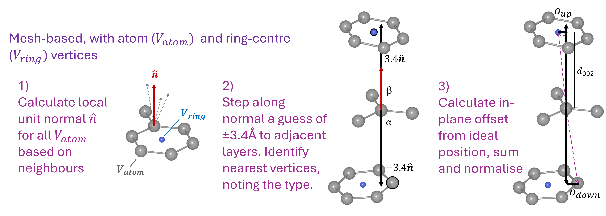
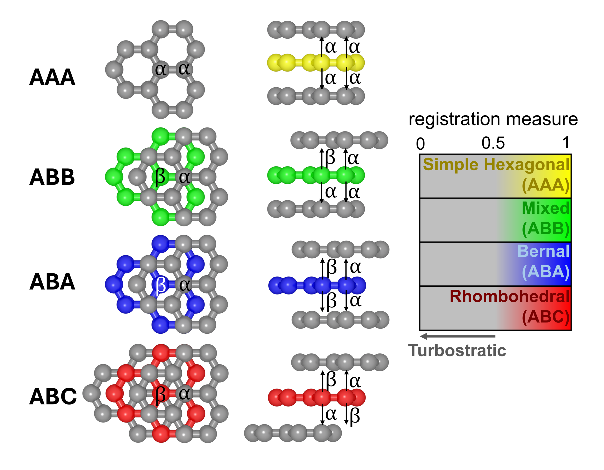
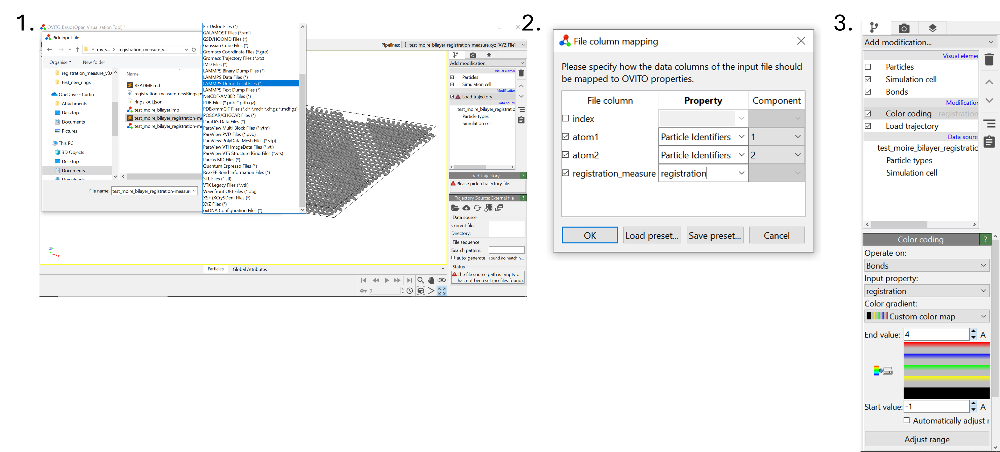
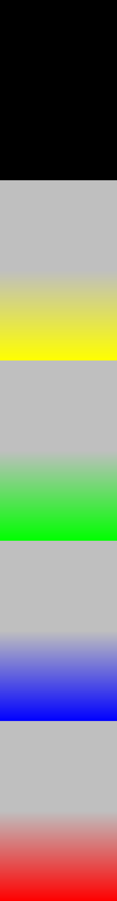
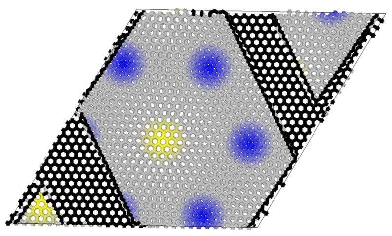

Authors: Gabriel R. Francas (gabriel.francas@postgrad.curtin.edu.au), Anouar A. Delenda, Jacob W. Martin, Nigel Marks, Chris Ewels.                                                                                 
 Last modified: 25/06/2025                                                                                

# Purpose: 
This program is designed to analyse the stacking registration for a mostly sp2 carbon based atomistic model. The system should be largerly composed of layered graphenic sheets, which may be curved. This program will calculate the local registration for each neighbouring pair of sp2 atoms (ie. each bond) in terms of the layers directly above and below. A degree of registration is calculated ranging from 0 (completely unregistered, ie. turbostratic) to 1 being perfect registration. The type of stacking will also be determined as either being more closely in line with AAA (hexagonal), ABB (mixed), ABA (bernal) or ABC (rhombohedral) stacking. The type of stacking will change the final output number 'registration-measure' such that in the range   [0-1] = AAA, (1-2] = ABB, (2-3] = ABA, (3-4] = ABC. Thus the registration measure value can be used to colour code the atoms for example in OVITO using an appropriate colour bar (eg. as attached). The bond-wise registration measure data is ouput as a .dump file in the format of a lammps dump local file. This can be loaded into OVITO by using 'load trajectory' modifier. The mean registration measure for each sp2 atom is also saved as a column in the output .xyz file for when the type of stacking is not relavant. In the case where the stacking cannot be measured because the atom is not sp2 or it is missing an adjacent layer above or below it will be assigned a registration measure of -1.

# Approach & Scalebar

<p align="center">
  
</p>


Further details of the approach and an example in a scientific context are to be published...stay tuned :)

<p align="center">
  
</p>


# Dependencies 

- Numpy 
- [Atomic Simulation Environment (ASE)](https://wiki.fysik.dtu.dk/ase/index.html)
- [julia_rings](https://github.com/MorrowChem/RingsStatisticsMatter.jl) and associated dependencies

# Usage
### Default:
The only argument required to run the program is the name of the [lammps data file](https://docs.lammps.org/Run_formats.html#input-file) to perform the analysis on. 

```
>> python3 registration_measure.py -i <input_file.lmp>
```

### Optional arguments:
```
>> python3 registration_measure.py -h

usage: registration_measure.py [-h] [--input INPUT] [--output OUTPUT] [--processors PROCESSORS] [--detail]

This script analyses the stacking order within a graphitic system

options:
  -h, --help            show this help message and exit
  --input INPUT, -i INPUT
                        Path to input file to analyse
  --output OUTPUT, -o OUTPUT
                        Default =<input>_registration-measure. Option to change the output file names. Both files will have the same name, differentiated by extensions of
                        .dump and .xyz.
  --processors PROCESSORS, -p PROCESSORS
                        Default=1. How many cpu's to use for parallel loop
  --detail, -d          Default=False. Write extra .xyz file with more detail including neighbourhood bondlengths per atom and normal vector?
```

### Output visualisation in [OVITO](https://www.ovito.org/):

The output from the code is three files: 

- an extended .xyz which contains the measured average interlayer distance per atom and average registration measure per sp2 atom based on its three bonds. 
- a .dump file in the format of a LAMMPS dump local file, specifying the bond-wise registration measure which includes detail of the stacking type. 
- a .json file specifying the rings found by the ring search algorithm (not needed for visulation or analysis)

To view in OVITO:
1. Open the .xyz file and then use the 'load trajectory' modifier to inport the .dump file. The 'LAMMPS Dump Local Files (*)' format should be selected. 
2. The first time this is used you will need to assign the columns to the appropriate properties within Ovito. You can make your own property called 'registration-measure'. 
3. Add 'Color coding' modifier. Switch 'operate on:' to bonds and 'Input property:' to registration. Add custom color bar (attached/below) and set bounds from -1 to 4.

<p align="center">
  
</p>

<p align="left">
  
</p> Colorbar to be used in OVITO


### Example: twisted bilayer with edges

As an example a file containing a twisted graphene bilayer with some material missing is available. The final output should show bonds coloured black where the registration cannot be defined, largely grey where the registration in poor and areas of blue and yellow where the stacking is AB and AA respectively. 

<p align="center">
  
</p>

